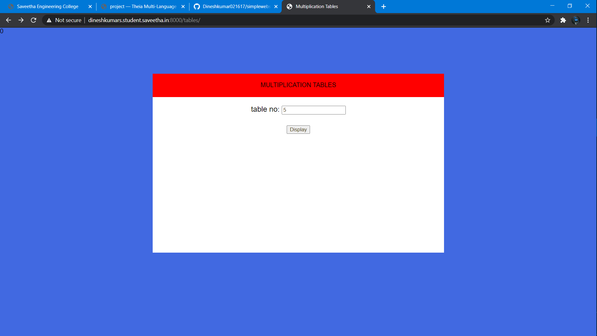
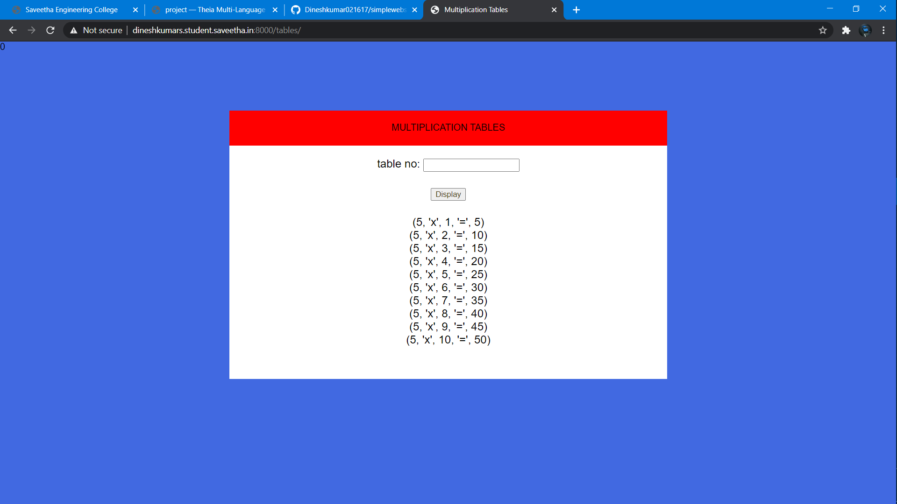

# Developing a Simple Webserver
## AIM:
To develop a simple webserver to serve html pages.

## DESIGN STEPS:
### Step 1: 
HTML content creation
### Step 2:
Design of webserver workflow
### Step 3:
Implementation using Python code
### Step 4:
Serving the HTML pages.
### Step 5:
Testing the webserver

## PROGRAM:
```

<!DOCTYPE html>0
<html>
<head>
    <title>Multiplication Tables</title>
    <link rel="stylesheet" href="">
</head>
<body>
    <div class="container">
        <div class="formview">
            <div class="banner">
                MULTIPLICATION TABLES
            </div>
            <div class="content">
                <form action="/tables/" method="POST">
                    
                    <div class="forminput">
                        <label for="number">table no:</label>
                        <input type="text" name="number" id="number">
                    </div>                    
                    <div class="forminput">
                        <button type="submit" name="button_volume" id="button_volume">Display</button>
                    </div>
                </form>
                <div class="forminput">
                    
                        {{i}}</br>
                    
                </div>
            </div>
        </div>
    </div>
</body>
</html>
```

## OUTPUT:



## RESULT:
Thus a website is designed to display multiplication table for a giving input and hosted in url http://dineshkumars.student.saveetha.in:8000/tables/ . 
